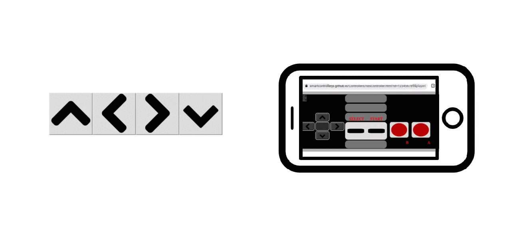

## NES controller tutorial

### Try the demo!

 <iframe src="https://smartcontrollerjs.github.io/Controllers/controller-receive-web.html" width="100%" height="300" ></iframe>

This tutorial will show you how to create a simple website <a href='https://smartcontrollerjs.github.io/Controllers/controller-receive.html'> demo </a> to process data from NES controller. Everytime an arrow key is pressed it is highlighted on the screen. <a href ='https://github.com/SmartControllerJS/Controllers/blob/main/src/controller_receive.js' target="_blank"> Source code </a> and <a href ='https://github.com/SmartControllerJS/Controllers/blob/main/docs/controller-receive.html' target="_blank"> html file</a>.

First create an empty html and js files, then start by editing the javascript file:

1. Add the smartcontroller library:

   ```js
   // Use the import statement for webpack or a different bundler
   import "smartcontroller";
   ```

   OR

   ```js
   //Add this tag to your html file
   <head>
     <script src="https://unpkg.com/smartcontroller@3.2.4/dist/smartcontroller.min.js"></script>
   </head>
   ```

2. Create the NES smart controller object and the QR code:

   ```js
   const simplePeer = new smartcontroller.NesSmartController("123456789");
   simplePeer.createQrCode(
     "https://smartcontrollerjs.github.io/Controllers/nesController.html",
     "qrcode",
     150,
     150,
     "1"
   );
   ```

3. Add a function to continually process the data and call it:

   ```js
   //a function that checks if player 1 is connected
   //if yes then check the arrow keys to highlight the buttons
   function processData() {
     if (simplePeer.controllerList[1]) {
       //store the controller to access its fields
       //the dictionary key is 1 because a player ID has been specified, otherwise the peer ID from smartphone will be used
       var controller = simplePeer.controllerList[1];
       var button_id = ["up", "down", "left", "right"];
       //check if up button is pressed, if yes change the background colour from gray to yellow
       //then do the same for the remaining arrows
       for (var id of button_id) {
         if (controller.buttons[id]) {
           document.getElementById(id).style.backgroundColor = "#e9ec06";
         } else {
           document.getElementById(id).style.backgroundColor = "#dddcdc";
         }
       }
     }
     requestAnimationFrame(processData);
   }

   processData();
   ```

   Now for the html file:

4. Create a div for the QR code:

   ```js
   <div id="qrcode">
     <p> Scan the QR code to connect! </p>
   </div>
   ```

5. Include your js script:

   ```js
   <script src="controller_receive.js"></script>
   ```

6. Make some buttons (you can find the images <a href="https://github.com/SmartControllerJS/Controllers/tree/main/docs/images"> here </a>):

   ```js
        <div class="btn-group">
            <button id="up"></button>
        </div>
   ```

And that's it! Your first smartcontroller website should be up and running!
