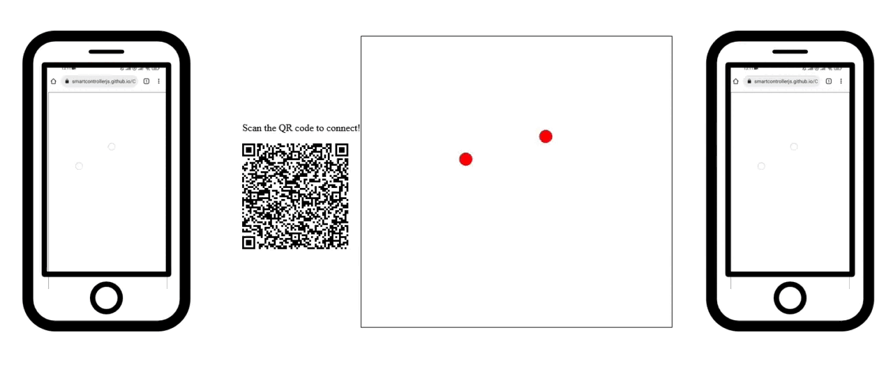

## Multiplayer touchpad tutorial

### Try the demo!

 <iframe src="https://smartcontrollerjs.github.io/Controllers/touchpad-receive-web.html" width="100%" height="500" ></iframe>

This tutorial will show you how to create a simple website <a href='https://smartcontrollerjs.github.io/Controllers/touchpad-receive.html'> demo </a> to process data from multiple touchpad controllers. The touches from phone will show on the browser, each phone will have a different colour. <a href ='https://github.com/SmartControllerJS/Controllers/blob/main/src/touchpad_receive.js' target="_blank"> Source code </a> and <a href ='https://github.com/SmartControllerJS/Controllers/blob/main/docs/touchpad-receive.html' target="_blank"> html file</a>.

First create an empty html and js files, then start by editing the javascript file:

1. Add the smartcontroller library:

   ```js
   // Use the import statement for webpack or a different bundler
   import "smartcontroller";
   ```

   OR

   ```js
   //Add this tag to your html file
   <head>
     <script src="https://unpkg.com/smartcontroller@3.1.0/dist/smartcontroller.min.js"></script>
   </head>
   ```

2. Create the Touchpad smart controller object and the QR code:

   ```js
   const simplePeer = new smartcontroller.TouchPadSmartController();
   simplePeer.createQrCode(
     "https://smartcontrollerjs.github.io/Controllers/touchpad.html",
     "qrcode",
     150,
     150
   );
   ```

3. Get the canvas details and add the player colours

   ```js
   var canvas = document.getElementById("coordinateCanvas");
   var ctx = canvas.getContext("2d");
   var colours = ["red", "yellow", "green", "blue", "orange"];
   ```

4. Add a function to continually process the data and call it:

   ```js
   //a function that loops over the connected touchpads and lets each player move balls on the screen
   function processData() {
     var i = 0;
     //clear canvas for a new frame
     ctx.clearRect(0, 0, canvas.width, canvas.height);

     //loop over the stored controllers
     for (var player in simplePeer.controllerList) {
       //store the controller to access its fields
       var touchpad = simplePeer.controllerList[player];
       //select a colour to draw the circles
       ctx.fillStyle = colours[i];
       i += 1;
       //check if the touchpad is being used
       if (touchpad.isActive) {
         //iterate over the list of coordinate pairs [x,y]
         for (var key in touchpad.state) {
           //for each pair scale the coordinates to the browser canvas size and draw a ball
           var finger = touchpad.state[key];
           ctx.beginPath();
           ctx.arc(
             finger[0] * canvas.width,
             finger[1] * canvas.height,
             10,
             0,
             2 * Math.PI
           );
           ctx.stroke();
           ctx.fill();
         }
       }
     }
     requestAnimationFrame(processData);
   }

   processData();
   ```

   Now for the html file:

5. Create a div for the QR code and canvas to draw on:

   ```js
   <div id="qrcode">
     <p> Scan the QR code to connect! </p>
   </div>

   <canvas id="coordinateCanvas" width="1200" height="700" style="border:1px solid #000000;"></canvas>
   ```

6. Include your js script:

   ```js
   <script src="touchpad_receive.js"></script>
   ```

And that's it! Your multiplayer smartcontroller website is ready!
