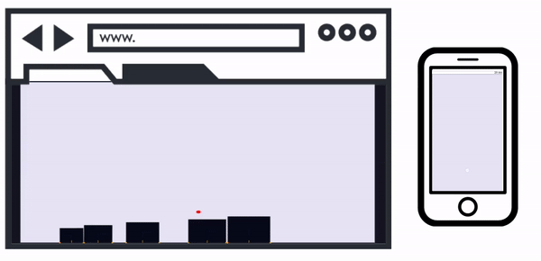

---
layout: default
title: Introduction
nav_order: 1
--- 
# SmartController: Peer-to-peer for creating smartphone controllers 

SmartController provides an easy way of turning a smartphone into versatile controller.

## How it works 

### 1. Include SmartController
Simply make a new SmartController object on your website. The connection and data will be handled automatically. 

### 2. Display the QRcode
Show a QRcode with the matching controller on your website for smarthphone to connect to. You can use one of the provided controllers or make your own! 

### 3. Control the website
Use the incoming data from phone to interact with PC browser. 

## Examples

### Tiny Platformer ###
Tiny platformer game with NES controller. Collect the gold coins and jump on the enemies to beat the level.  
Try the [tiny platformer](https://emmapoliakova.github.io/WebRTCSmartphoneController/demo/tinyPlatformer/index.html)

### 3D racing ###
3D racing game controlled with phone joystick. Use the joystick to steer, brake and jump. How many points can you score before the time runs out?  
Try the [3D Racer](https://emmapoliakova.github.io/WebRTCSmartphoneController/demo/3dRacing.html)

### Physics simulator ###
A physics simulator created with Matterjs. Use the touchpad to select and stack blocks.  
Try the [physics simulator](https://emmapoliakova.github.io/WebRTCSmartphoneController/physics/physicsDemoV3.html)
